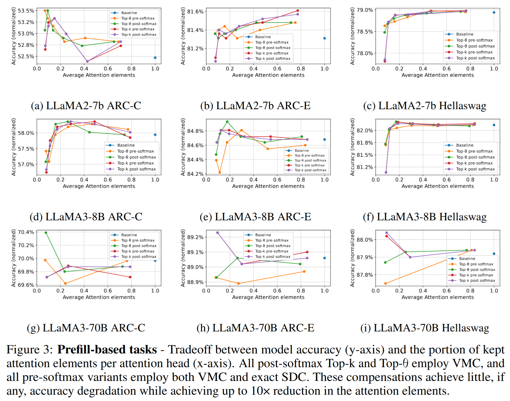
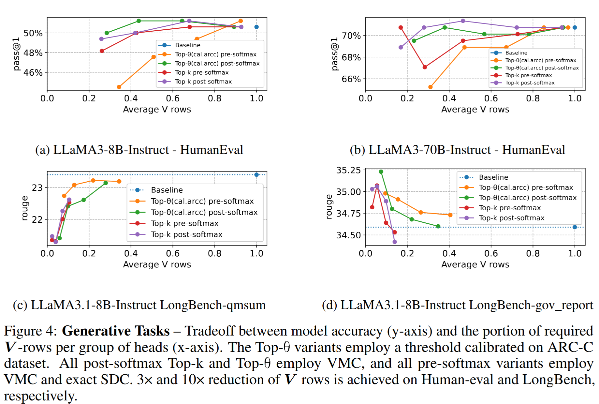

# Top-k & Top-θ Attention for Large Language Models

<p align="center">
  <a href="https://e-nns.org/icann2026/">
    
  </a>
  <a href="https://arxiv.org/abs/2502.08363">
    
  </a>
  
  
</p>

---

> Official implementation of **"Top-Theta Attention: Sparsifying Transformers by Compensated Thresholding"**, accepted at the **International Conference on Artificial Neural Networks (ICANN) 2026**.

---

Codebase to test **Top-k Attention** and **Top-θ Attention** on Large Language Models using the lm-eval-harness [1] framework, and text generation tasks including HumanEval [2] and LongBench [3].

Testing was done for the LLaMA models on [arc_challenge/arc_easy](https://huggingface.co/datasets/allenai/ai2_arc) / [hellaswag](https://rowanzellers.com/hellaswag) / [medmcqa](https://github.com/medmcqa/medmcqa) datasets for Q&A evaluation (prefill-only tasks) and on [humaneval](https://github.com/openai/human-eval) / [longbench](https://github.com/THUDM/LongBench) datasets (prefill + generative decoding). For detailed tested variants, refer to [reproduce.md](reproduce.md).

<p align="center">


</p>


## Install

```bash
# Create a conda/pyenv virtual environment in the local directory
conda create python=3.9.12 --prefix ./topksel
conda activate $(pwd)/topksel

# Install the human_eval repo [2] and enable unsandboxed evaluation of LLM-generated python programs
git clone https://github.com/openai/human-eval.git
pushd human-eval
sed -i 's/^#\s*\(.*exec(check_program, exec_globals).*\)/\                        exec(check_program, exec_globals)/'  human_eval/execution.py
sed -i 's/^.*assert len(completion_id) == len(problems), "Some problems are not attempted."/\        # assert len(completion_id) == len(problems), "Some problems are not attempted."/' human_eval/evaluation.py
pip install -e .
popd

# Install the lm-eval harness [1] and patch it with the calibration tasks for Hellaswag, Arc_Challenge, Arch_Easy and MedMCQA
git clone https://github.com/EleutherAI/lm-evaluation-harness.git
pushd lm-evaluation-harness
git checkout v0.4.8
echo -e "include: hellaswag.yaml\ntask: hellaswag_calibration\ntest_split: train\n" > lm_eval/tasks/hellaswag/hellaswag_calibration.yaml
echo -e "include: arc_challenge.yaml\ntask: arc_challenge_calibration\ntest_split: train\n" > lm_eval/tasks/arc/arc_challenge_calibration.yaml
echo -e "include: arc_easy.yaml\ntask: arc_easy_calibration\ntest_split: train\n" > lm_eval/tasks/arc/arc_easy_calibration.yaml
pip install -e .
popd

# Clone the longbench repo to enable accessability of the task confgurations [3]
git clone https://github.com/THUDM/LongBench.git

# Install the current topk_attention repo with its dependencies
# git clone <HERE COMES THE GITHUB REPO>topk_attention.git or just have the topk_attention directory ready with the code
pushd topk_attention
pip install -r requirements.txt
popd
```

## Entry point

1. `test_llama.py` - Runs Q&A task (hellaswag, arc_challenge, arc_easy, medmcqa) evaluations for Top-k and Top-theta (and baseline) on Llama models. To only calibrate thresholds - use _--calibrate_only_ flag.
2. `gen_llama.py` - Runs text generation task (humaneval, longbench-qmsum, longbench-gov_report) evaluations for Top-k and Top-theta (and baseline) on Llama models.
3. `topk_llama.py` - Implements Top-k and Top-theta modifications to Vanilla Attention
4. `topk_llama_chunked.py` - Implements Top-k and Top-theta modifications to Vanilla Attention - with support for chunked prefill to accommodate large sequence length above 30k tokens (tested with up to 50k tokens)

## Implementation

`topk_llama.py` contains the implementation of `TopK_LLamaAttention` class, a modified `LlamaAttention` layer from the transformers library. The `TopK_LLamaAttention` class implements all the functionality of Top-k attention and of Top-theta attention (including calibration). A few usage details:

1. `mode=0` implements only Top-theta, `mode=1` implements only Top-k, any other mode implements the baseline.

2. `update_model(model)` - function to replace all `LlamaAttention` with `TopK_LLamaAttention` layers.

3. `set_params(model, **params)` - function to set the parameters to the `TopK_LLamaAttention` layer e.g. mode, K etc.

## Evaluations

`test_llama.py` and `gen_llama.py` - runs evaluations for Top-k and Top-theta on Llama models.

Outputs:
* Results are logged in the _results-*_ directories.
* Various products of the run are dumped to a dedicated and time-stamped sub-directory under the _products_ directory.

Instructions for reproducing the experiments are in [reproduce.md](reproduce.md)

### Example of running an evaluation

1. Evaluate llama2-7b on hellaswag task using Top-theta attention (`--mode 0`) calibrated for k=64 (`--k 64`) for all layers except layer 0 and 1 (`--layerk 0:512,1:512`), where the thresholding should be placed before the softmax (`--placement pre-softmax`). During the calibration, for every (layer,head,seqlen) determine an individual threshold value by taking the average threshold across the thresholds found at the different calibration samples and increase this average by 0.1 standard deviation (`--calib_add_sigma 0.1`). In addition, during the calibration apply the recommended topk-at-calibration feature (`--calib_tac`) to emulate the presence of thresholding. During the inference, apply softmax denominator compensation of the type "offline-calibrated" (`--sdc offline-calibrated`) and use V-mean compensation (`--vmc`). The option `--timestamps` could become default in the future, but for now it is required to specify it in order to create a separate products subdirectory for the files being dumped during the evaluation run.
```bash
python test_llama.py --timestamps --llama 2-7 --task hellaswag --mode 0 --k 64 --layerk 0:512,1:512 --placement pre-softmax --calib_tac --calib_add_sigma 0.1 --sdc offline-calibrated --vmc
```

2. Evaluate codellama-34b model with Top-theta attention (`--mode 0`) calibrated for k=64 (`--k 64`) for all layers except layer 0 and 1 (`--layerk 0:512,1:512`), where the thresholding should be placed before the softmax (`--placement pre-softmax`). The test set consists of the first 20 out of 167 test examples (tasks) of the humaneval dataset. Evaluate only a single output per task (quality metric will be pass@1). No SDC or VMC compensations are applied. The model is allowed to generate tokens until the EOS token is generated or until the total sequence length reaches 2048 before being halted.
```bash
python gen_llama.py --timestamps --llama 34 --mode 0 --k 64  --layerk 0:512,1:512 --placement pre-softmax --calib_add_sigma 0.1 --calib_sample_frac 1.0 --calib_tac  --num_samples_per_task 1 --max_seq_len 2048
```

## Plotting

`scripts/plot_th_llama.py` - Plots the calibrated thresholds for different layers & Attention matrix size required w.r.t Top-theta during evaluation using calibrated thresholds. The produced plots are written to the products subdirectory of the evaluation (`-d`) and all have the title specified after the argument `-t`.

```bash
python plot_th_llama.py -d "products/2024-04-29_17-29-01_774054" -t "CodeLLaMA-34b-arc_challenge Top-th pre-softmax (k=512,512,128,128,...) single-k calibration mean+1.0*sigma, nacc=52.39% (base=54.44%)"
```

`scripts/plot_gen_llama.py` - important plots of the prompt and completion lengths

Check out the [notebooks](notebooks/) for various visualization capabilities.

## Limitations

1. Calibration of thresholds for top-theta is enabled only through test_llama.py (which uses the topk_llama.py implementation) therefore possible on QA tasks on relatively short (few thousands of tokens). To solve it - the commented-out code in topk_llama_chunked.py
2. QA tasks evaluation (test_llama.py) is limited to few thousands of tokens sequence length. To enable longer sequences -- need to import _TopK_LLamaAttention_ from topk_llama_chunked.
3. To dump statistics that enable attention topk visualizations ([notebooks/3](notebooks/3-vrow_popularity.ipynb)) one needs to pass an empty list to _dump_stats_set_exclude_ in the set_params() in gen_llama.py. Only then running gen_llama.py will produce the corresponding txt output files visualizable by the [notebooks/3](notebooks/3-vrow_popularity.ipynb).
4. Thresholds produced after calibrations (th.txt file) is not undergoing any smoothening/interpolation or fitting to a function. The smoothening is implemented separately in [scripts/th_interpolate_and_smoothen.py](scripts/th_interpolate_and_smoothen.py) and it could be a good practice to incorporate it as a permanent post-processing step after calibration.

## Citation

If you use this code in your research, please cite our paper:

```bibtex
@misc{berestizshevsky2025toptheta,
      title={Top-Theta Attention: Sparsifying Transformers by Compensated Thresholding}, 
      author={Berestizshevsky, Konstantin and Andri, Renzo and Cavigelli, Lukas},
      year={2025},
      eprint={2502.08363},
      url={https://arxiv.org/abs/2502.08363}, 
}
```

## References

[1] https://github.com/EleutherAI/lm-evaluation-harness <br>
[2] https://github.com/openai/human-eval <br>
[3] https://github.com/THUDM/LongBench <br>
